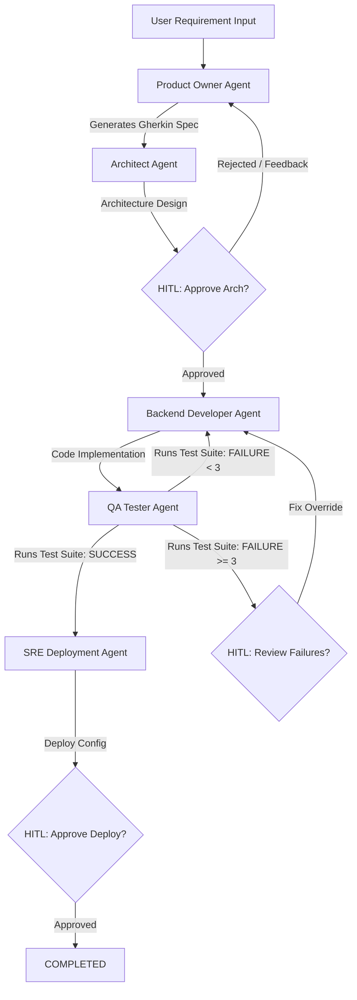

# AI-Agents-System (Autonomous SDLC Software Factory)

Un sistema multiagente autónomo estructurado como una factoría de software para el Ciclo de Vida del Desarrollo de Software (SDLC). El orquestador guía un flujo secuencial donde los agentes colaboran en la generación de especificaciones, diseño de arquitectura, codificación, pruebas automatizadas y despliegue, incorporando **Autocuración (Self-Healing)** y revisión humana **HITL (Human-in-the-Loop)**.

---

## 🤖 El Pipeline de Agentes y Flujo SDLC

El sistema consta de 5 agentes especializados que actúan sobre el espacio de trabajo local:



1. **Product Owner Agent (`PRODUCT_OWNER`):** Recibe la descripción de la feature del usuario y la refina en Historias de Usuario estructuradas en formato Gherkin (Given-When-Then).
2. **Architect Agent (`ARCHITECT`):** Diseña el plano técnico y la arquitectura del sistema. Requiere aprobación humana (HITL) para pasar a desarrollo.
3. **Backend Developer Agent (`BACKEND`):** Escribe el código Java funcional en base a la arquitectura y las especificaciones.
4. **QA Tester Agent (`QA`):** Escribe y ejecuta pruebas de integración automatizadas.
   * **Bucle de Autocuración (Self-Healing):** Si las pruebas fallan, el QA devuelve el flujo al Backend Agent enviando las trazas de error de JUnit. Se realizan hasta 3 reintentos automáticos.
   * Si tras 3 intentos el fallo persiste, el flujo se detiene requiriendo revisión manual (HITL).
5. **SRE Deployment Agent (`SRE`):** Genera manifiestos e infraestructura de despliegue. Requiere aprobación humana final antes del cierre.

---

## 🛠️ Stack Tecnológico

### Backend
* **Lenguaje:** Java 21
* **Framework:** Spring Boot 4.1.0-RC1 (con Soporte Nativo para Hilos Virtuales)
* **Orquestación AI:** Spring AI 2.0.0-SNAPSHOT (con soporte dinámico para múltiples proveedores)
* **Diseño Arquitectónico:** Arquitectura Hexagonal limpia + Principios de Domain-Driven Design (DDD)
* **Base de Datos:** PostgreSQL (con extensión PGVector)
* **Caché y Mensajería:** Redis

### Frontend
* **Framework:** Vue 3 + Vite
* **Estilo:** CSS Moderno y Glassmorfismo Premium (Panel reactivo de visualización en tiempo real del estado de los agentes, trazas y solicitudes de aprobación manual)

---

## 🚀 Guía de Inicio Rápido (Local)

### Requisitos Previos
* Docker y Docker Compose
* JDK 21 o superior
* Maven 3.9+
* Node.js 18+ y npm

---

### Paso 1: Levantar Servicios Compartidos (Postgres & Redis)
Inicia los contenedores desde la raíz del proyecto para crear la base de datos `ai_agentic_system_db` y el almacén Redis:

```bash
docker compose up -d
```

---

### Paso 2: Configurar y Ejecutar el Backend (Spring Boot)

El backend soporta dos perfiles principales de IA. Escoge uno según tus necesidades:

#### Opción A: Perfil Google Gemini (Por Defecto)
Asegúrate de exportar tu clave de API:

```bash
export GOOGLE_GENAI_API_KEY="tu-api-key-de-gemini"
cd backend
mvn spring-boot:run
```

#### Opción B: Perfil Local LLM (LM Studio / Ollama)
Si prefieres ejecutar un modelo local compatible con el API de OpenAI levantado en el puerto `1234` (por ejemplo, Llama 3 o Qwen):

```bash
export LM_STUDIO_URL="http://localhost:1234"
export LM_STUDIO_MODEL="llama-3" # El nombre de tu modelo cargado en LM Studio
cd backend
mvn spring-boot:run -Dspring.profiles.active=lmstudio
```

*El backend se levantará en `http://localhost:8080` y expondrá su documentación interactiva de Swagger en `http://localhost:8080/swagger-ui/index.html`.*

---

### Paso 3: Ejecutar el Frontend (Vue 3 / Vite)

1. Ve a la carpeta `frontend/`:
   ```bash
   cd frontend
   npm install
   ```
2. Inicia el servidor de desarrollo:
   ```bash
   npm run dev
   ```
3. Abre tu navegador en [http://localhost:5173](http://localhost:5173).
4. Asegúrate de conectar con el API local indicando la dirección `http://localhost:8080` en la barra superior.

---

## 📂 Estructura del Directorio del Proyecto

```
AI-Agents-System/
├── .agents/                    # Reglas de Gobernanza y bitácora de decisiones agénticas (ADR)
├── .github/skills/             # Manuales de habilidades técnicas para los subagentes AI
├── backend/                    # Proyecto Java Spring Boot (Hexagonal)
│   ├── src/main/java/com/swfactory/sdlc/
│   │   ├── application/        # Casos de Uso y Servicios
│   │   ├── domain/             # Entidades de Dominio, Interfaces de Agentes y Puertos
│   │   └── infrastructure/     # Adaptadores (Spring AI, REST Controllers, JPA, Redis)
│   └── pom.xml
├── frontend/                   # Dashboard Interactivo en Vue 3
│   ├── src/
│   │   ├── App.vue             # Componente Principal del Dashboard (Glassmorphic)
│   │   └── style.css           # Diseño del Sistema
│   └── package.json
├── docker-compose.yml          # Postgres (PGVector) y Redis
├── AGENTS.md                   # Constitución Oficial del Workspace
└── README.md                   # Esta guía
```

---

## 📝 Constitución y Triggers de Desarrollo (`AGENTS.md`)
El comportamiento técnico del sistema y las rutas de autocuración de archivos se rigen bajo las reglas estipuladas en [AGENTS.md](file:///home/tino/Projects/AI-Agents-System/AGENTS.md). 
Cualquier modificación o testeo debe seguir el flujo hexagonal y libre de Lombok (utilizando Records de Java 21) detallado en dicha constitución.
